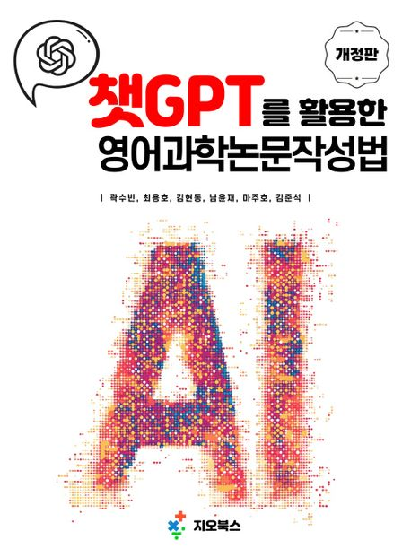

  

    
  

  

  <ol>
  <li>1. 챗GPT를 활용한 영어과학논문작성법 (개정판) 
  <b>곽수빈</b>, 최용호, 김현동, 남윤재, 마주호, 김준석 | <em>지오북스</em> | 2025. 04. 01. | ISBN: 9791194145226</li>
  </ol>
  

1. 챗GPT를 활용한 영어과학논문작성법 (개정판) 
**곽수빈**, 최용호, 김현동, 남윤재, 마주호, 김준석 | *지오북스* | 2025. 04. 01. | ISBN: 9791194145226

1. 챗GPT를 활용한 영어과학논문작성법 
**곽수빈**, 최용호, 김준석 | *지오북스* | 2023. 07. 01. | ISBN: 9791191346626

1. 다상 유체 유동에 대한 상태장 모델링과 멀티그리드 수치기법 
**곽수빈**, 강승윤, 황영진, 함석준, 이경규, 최용호, 김준석 | *지오북스* | 2023. 02. 28. | ISBN: 9791191346572

1. MATLAB 활용 수치해석 
김준석, **곽수빈**, 이채영, 황영진, 강승윤, 함석준, 이경규 | *지오북스* | 2022. 04. 01. | ISBN: 9791191346626

1. 코딩수학 파이썬 1 
김상권, 김현동, **곽수빈**, 황영진, 김준석 | *지오아카데미* | 2021. 09. 01. | ISBN: 9791191346077

1. 수학적 모델링 콘텐츠 파이썬 1 
김준석, 김상권, 이채영, 최용호, **곽수빈**, 황영진 | *지오북스* | 2021. 09. 01. | ISBN: 9791191346091

1. 텐서플로 25시간만에 배우는 머신러닝 예제 
김상권, 김현동, **곽수빈**, 한현수, 장한별, 김준석 | *지오아카데미* | 2021. 05. 01. | ISBN: 9791191346046

1. 보르노이 다이어그램 
김준석, **곽수빈**, 김상권, 윤성하, 김현동, 문현, 이채영 | *지오북스* | 2020. 11. 01. | ISBN: 9791187541943

1. 파이썬 활용 산업응용수학의 기본 
김준석, 김상권, 이채영, 정다래, 최용호, **곽수빈** | *지오북스* | 2020. 09. 10. | ISBN: 9791187541882