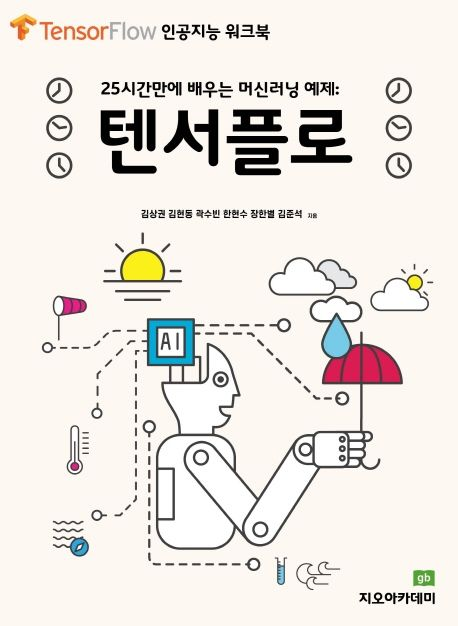

<ol class="book-list";>
  <li>
    
    

      챗GPT를 활용한 영어과학논문작성법 (개정판) 
      <b>곽수빈</b>, 최용호, 김현동, 남윤재, 마주호, 김준석 | <em>지오북스</em> | 2025. 04. 01. | ISBN: 9791194145226
    

  </li>

  <li>
    
    

      챗GPT를 활용한 영어과학논문작성법 
      <b>곽수빈</b>, 최용호, 김준석 | <em>지오북스</em> | 2023. 07. 01. | ISBN: 9791191346626
    

  </li>

  <li>
    
    

      다상 유체 유동에 대한 상태장 모델링과 멀티그리드 수치기법 
      <b>곽수빈</b>, 강승윤, 황영진, 함석준, 이경규, 최용호, 김준석 | <em>지오북스</em> |  2023. 02. 28. | ISBN: 9791191346572
    

  </li>

  <li>
    
    

      MATLAB 활용 수치해석 
      김준석, <b>곽수빈</b>, 이채영, 황영진, 강승윤, 함석준, 이경규 | <em>지오북스</em> | 2022. 04. 01. | ISBN:  9791191346374
    

  </li>

  <li>
    
    

      코딩수학 파이썬 1 
      김상권, 김현동, <b>곽수빈</b>*, 황영진, 김준석 | <em>지오아카데미</em> | 2021. 09. 01. | ISBN: 9791191346077
    

  </li>

  <li>
    
    

      수학적 모델링 콘텐츠 파이썬 1 
      김준석, 김상권, 이채영, 최용호, <b>곽수빈</b>, 황영진 | <em>지오북스</em> | 2021. 09. 01. | ISBN: 9791191346091
    

  </li>

  <li>
    
    

      텐서플로 25시간만에 배우는 머신러닝 예제 
      김상권, 김현동, <b>곽수빈</b>, 한현수, 장한별, 김준석 | <em>지오아카데미</em> | 2021. 05. 01. | ISBN: 9791191346046
    

  </li>

  <li>
    
    

      보르노이 다이어그램 
      김준석, <b>곽수빈</b>, 김상권, 윤성하, 김현동, 문현, 이채영 | <em>지오북스</em> | 2020. 11. 01. | ISBN: 9791187541943
    

  </li>

  <li>
    
    

      파이썬 활용 산업응용수학의 기본 
      김준석, 김상권, 이채영, 정다래, 최용호, <b>곽수빈</b> | <em>지오북스</em> | 2020. 09. 10. | ISBN: 9791187541882
    

  </li>

</ol>

Last updated: {{ site.time | date: "%Y-%m-%d" }}

